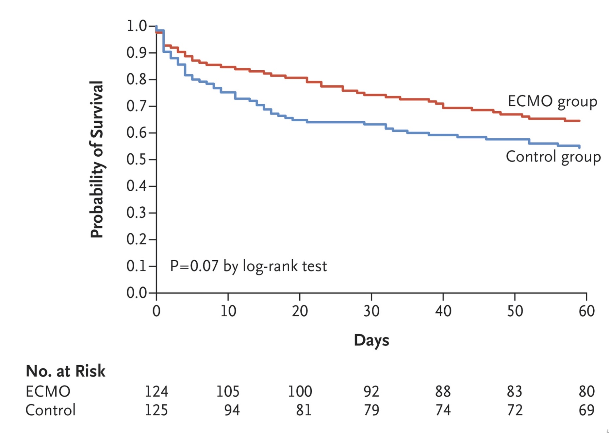
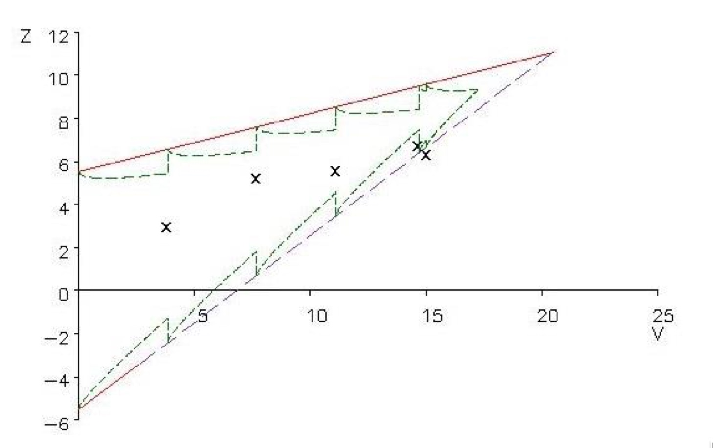
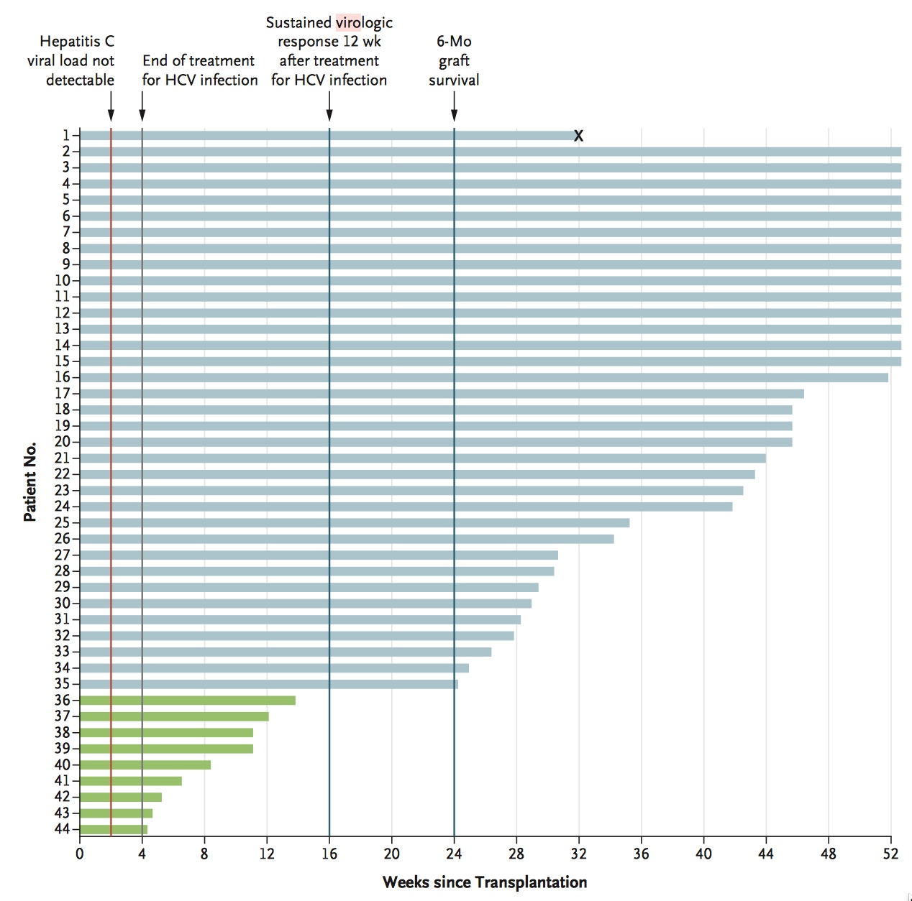

# Design Issues

### Anticipating Tx effects

Inotuzumab Ozogamicin versus Standard Therapy for ALL (NEJM 25 Aug 2016)

{ width=75% }

###

{ width=75% }

### Metastic prostate cancer

{ width=80% }

Hussain, et al., Eur J Cancer, Sep 2015

### Correct assumptions may depend on disease and/or agent

From Alexander, et al., NEJM March 2018

{ width=90% }

### Substantial methodology available

Korn and Freidlin, 2018 JCO, Am. J.Bioethics 2011

Freidlin and Korn, Clin Trials, 2009; Cont Clin Trials, 2002

Work presented at Feb 2018 Duke Margolis Workshop

- Oncology Clinical Trials in the Presence of Non-Proportional Hazards

# Issues external to the trial

### Following the monitoring plan was the wrong thing to do 

Extracorporeal Membrane Oxygenation ECMO for ARDS (NEJM 24 May 2018) 

{ width=75% }

Figure 2

### ECMO Stopping Rule: Figure S1

{ width=70% }

- Trial stopped for futility at 4th interim analysis, with 240/331 patients.

- HR 0.70 favoring ECMO, 95% confidence interval (0.47, 1.04), p = 0.07

### Not following the plan was the right thing to do

Heart and Lung Transplants from HCV+ Donors (Woolley, et al.,NEJM 25 April 2019)

- Original Design based on Simon two-stage phase II design.

- Amended to modified SPRT to allow continuous monitoring.

  - Boundaries for superiority and safety

### HCV+ Transplanted organs \ldots

{ width=68% }

Figure 2: Crossed stopping boundary for efficacy at 13 patients with 6 mo follow-up

### Recommendations/Questions

- DMC and FDA should probe whether monitoring plan uses

  - Best available data to anticipate nature of differences.
  
  - Best available methodology for monitoring 

- In the absence of harm, non-significant but positive Tx effects may be important.

  - Be reluctant to stop when HR favors experimental Tx

- Monitoring plans should incorporate interim sensitivity analyses for different types of Tx effects.

- Is a surrogate endpoint risky? (eg, PFS vs OS) 

### Recommendations \ldots

- DMC should be less literal in executing monitoring plans when faced with external information.

- Data sharing between DMCs or between DMC and FDA should be guaranteed confidential, including the use of secure communications.

- Does the FDA perspective on interim futility monitoring coincide with trials not designed for regulatory approval?

- Should we continue to design around proportional hazards?

<!---

Notes on delivered talk:

- Trippa table difficult to read; pieces should be exploded

- Graphic showing the data in hcv transplant study also too small.

Outline

- Two examples: futility analysis in ECMO

- My transplant trial

- Other examples in the paper

- How much flexibility does the dmc have

- Confidentiality is essential

Issues to contend with

Notes

- Korn, Friedlin, etc CCT, 1999: interim analyses every 6 months. 
good examples of trials were design was defied

- Korn, Friedlan 2002:  On the other hand, aggressive monitoring rules may result in an early termination for futility when the experimental arm is doing better than the control arm (in some cases nontrivially better, especially when trials are designed for unrealistically large effects). Thus, aggressive monitoring rules may fail to provide sufficiently convincing evidence to influence clinical practice or to establish a standard of treatment.

- See discussion for summary, esp when the experimental arm is numerically better.  

--->

<!--stackedit_data:
eyJoaXN0b3J5IjpbLTEyNTc0MzQ5MTldfQ==
-->