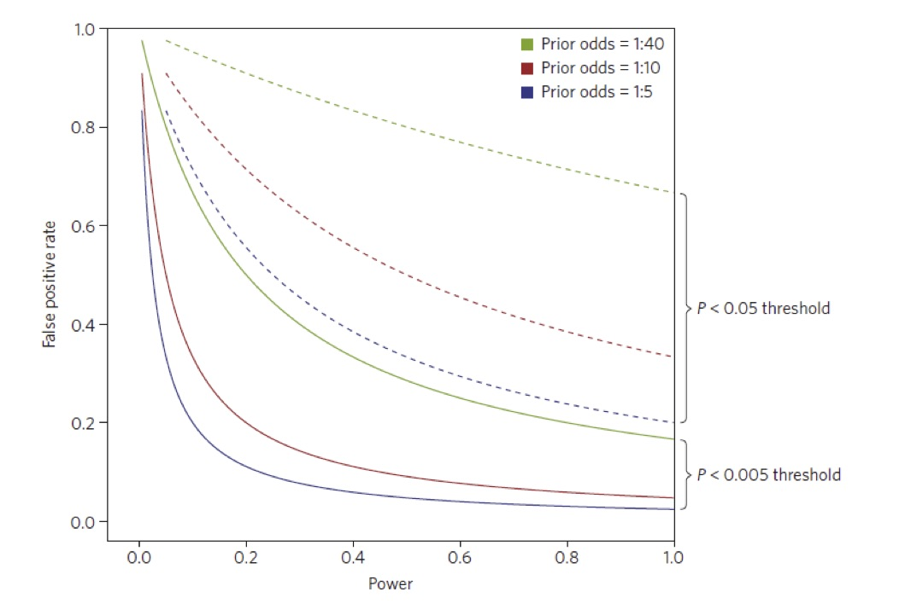

# Interpreting study design and analysis     

###  Main elements of the design -- RCTs and observational studies 

```{r global_options, echo=FALSE}
knitr::opts_chunk$set(warning=FALSE, message=FALSE)
```  

Plan to minimize bias?

- RCT: Randomization, blinding, identical evaluation/follow-up schedules

- Observational studies: record important confounders, plan for post-hoc adjustment, perhaps include matching in recruitment

Chance of detecting important effects/associations? (Adequately powered, at leat 80%) \medskip

Plan to minimize false positive results if many endpoints/subgroups examined?

- More difficult with large observational studies, especially genomics/genetics  


### Power and type I error

Type I error (alpha error)

- Probability that trial will report a false positive, i.e., claim a significant result when there is no treatment effect.

- Typically set no larger than 5%

- Depends on method of analysis, does not depend on sample size

### Power 

- Probability that the trial will report a true positive, i.e., claim a significant result when there is a treatment effect.

- Should be 80% or greater

- Depends on sample size, method of analysis and size of treatment effect.

- Power calculations relevant when study is designed.

- Power calculations have little value after a study is complete.

    -  Precision measured through confidence intervals  

### Design of SPRINT (NEJM 26 Nov 2015)

From the methods section of the paper:

\begin{quote}
We planned a 2-year recruitment period, with a maximum follow-up of 6 years, and anticipated a loss to follow-up of 2\% per year. With an enrollment target of 9250 participants, we estimated  that the trial would have 88.7\% power to detect  a 20\% effect with respect to the primary outcome, assuming an event rate of 2.2\% in the standard-treatment group.
\end{quote}


### Calculating Power

Next two slides show graphs of power in hypothetical study of a blood pressure lowering medication. \medskip

Two medications, experimental vs control, using $\alpha = 0.05$

- First, power as a function of sample size if true effect is 3mmHg reduction

- Second, power as a function of reduction in bp (effect size) for sample size 250 per group.


### Power vs. sample size

\small

```{r power_sample, fig.height=3.5, fig.width=4.5, echo=FALSE}
library(openintro)
data("COL")
n <- c(10:500, seq(510, 2000, 10), seq(2100, 10000, 100))
se <- sapply(n, function(x) sqrt(2 * 12^2 / x))
left.reject <- -1.96 * se
x <- (left.reject - (-3)) / se
p <- pt(x, 2 * n - 2)

plot(n, p,
     xlab = "Sample Size Per Group",
     ylab = "Power",
     xlim = c(20, 5000),
     ylim = 0:1,
     type = "n",
     log = "x",
     axes = FALSE)
axis(1)
axis(2)
abline(h = 0:1, lty = 2, col = COL[6,2])
lines(n, p, col = COL[1], lwd = 2)
```

More than about 250 to 350 per group doesn’t provide much additional value.


### Power vs. effect size, 250 participants per group


```{r power_effect, fig.height=3.9, fig.width=4.9, echo=FALSE}
library(graphics)
library(openintro)
data("COL")
n.total = 2*250
reporter.power = function(x) pnorm(-1.96 + x/sqrt(2 * 12^2/250))
curve(reporter.power, 0, 6, n = 1000, col=COL[1], xlab = "Effect Size mmHG",
      ylab="Power", lwd=2, axes="FALSE")
axis(1)
axis(2)
abline(h = 0:1, lty = 2, col = COL[6,2])
```


### Confidence intervals

Confidence intervals are the preferred way to summarize outcome data, and are more informative post-hoc than power calculations.  \medskip

Easiest definition: 


- Confidence interval provides a single estimate with a `margin of error'.

- The size of the margin is determined by the variability in the data and the `confidence coefficient'  

Confidence coefficient is the proportion of times (in repeated sampling) an interval will contain the true treatment effect.
    
    
### Measuring precision after study completion

From \textit{Postmenopausal estrogen use and progestin use and the risk of cardiovascular disease,} NEJM 15 August 1996


\begin{quote}
We observed a marked decrease in the risk of major coronary heart disease among women who took estrogen with progestin, as compared with the risk among women who did not use hormones (multivariate adjusted relative risk, 0.39; 95 percent confidence interval, 0.19 to 0.78) \ldots
\end{quote}    


### Measuring precision after study completion


\begin{quote}
However, there was no significant association between stroke and use of combined hormones (multivariate adjusted relative risk, 1.09; 95 percent confidence interval, 0.66 to 1.80) \ldots

\end{quote}
 
  
### Controlling type I error

\small

The more tests one does, the more likely it is that *at least one* will be a false positive. \medskip

Suppose each test is done at level $\alpha = 0.05$.

-------------------------------------------------------
  Number of Comparisons        Experimentwise Error
------------------------- -----------------------------
    1                        0.05 

    2                        0.10 

    3                        0.14 

    5                        0.23 

   10                        0.40
   
   100                      >0.90
 
--------------------------------------------------------

Experimentwise error: at least one positive result when there are no treatment effects.

Dangerous in the analysis of subgroups.

### Controlling type 1 error

Assume target experimentwise error 5% ($\alpha =0.05$) \medskip

Bonferroni approximation, no order specified for comparisons

-  Divide significance level by number of planned tests

-  5 comparisons, use p = 0.01

-  Not practical when many comparisons planned, especially in genetics studies

### Controlling type 1 error\ldots

Holm's method, no order specified  

- Order the p-values from smallest to largest  

- Stop testing as soon as a p-value is too large  

- 5 comparisons:  

    - Compare smallest p-value to 0.05/5 = 0.01.   

    - Compare next smallest to 0.05/4 =  0.0125.  
     
    - Next smallest to 0.05/3  
   
    - etc


# Special topic: What happens when there is attrition?

### Problems caused by attrition

Attrition in an RCT can cause several problems

- Random attrition reduces effective sample size

- Missing data from non-random attrition can cause bias 

Two strategies in general use:

- Intent-to-treat (ITT)

- Per protocol (PP)

Neither is perfect


### Intent-to-treat (ITT) vs. per-protocol (PP)

ITT: analyze according to assigned treatment, not treatment received. \medskip

Main justification:

- p-values are calculated assuming no treatment difference (the null hypothesis)

- Under that assumption,  assigned treatment does not affect outcome.

- p-values will be correct (valid) when comparing the two groups according to treatment assignment.

Example may help make this clear.


### Simple trial, success vs failure outcome, no difference, non-random crossover

\small

Suppose two treatments ($A$ and $B$) are equally effective.

100 participants randomized to each treatment.

ITT table:

-------------------------------------------------
 Response     Treatment $A$        Treatment $B$
----------- ---------------- --------------------
 Success         40              40 

 Failure         60              60 

-------------------------------------------------

Now assume, after randomization:

- 10 participants with good prognosis (future responders) switch from $A$ to $B$

- 10 participants with bad prognosis (future non-responders) switch from $B$ to $A$


### Simple trial, but with selective crossovers.

Two treatments still equally effective.

Table for the as-treated groups

-------------------------------------------------
 Response     Treatment $A$        Treatment $B$
----------- ---------------- --------------------
 Success         30              50 

 Failure         70              50 

-------------------------------------------------


An as-treated analysis would imply $B$ more effective than $A$

###  ITT can be biased when there is a real treatment effect (random crossovers)

\small

Suppose $B$ is more effective than $A$, so for 100 in each group:

-------------------------------------------------
 Response     Treatment $A$        Treatment $B$
----------- ---------------- --------------------
 Success         30              50 

 Failure         70              50 

-------------------------------------------------

Assume 10 randomly chosen participants from each group switch treatments,
after randomization but before starting treatment.


### Table with just patients who do not switch

-------------------------------------------------
 Response     Treatment $A$        Treatment $B$
----------- ---------------- --------------------
 Success         27              45 

 Failure         63              45 

-------------------------------------------------

Attrition did not change measured success rates

- but it does reduce the effective sample size

What happens when `switchers' are put back in?

- 10 $A$ $\rightarrow$ $B$, 5 respond, 5 do not

- 10 $B$ $\rightarrow$ $A$, 3 respond, 7 do not

### ITT Table with assigned treatment, real response 

$A$ gets 5 responders (who received B)

$B$ gets 3 responders (who received A)

-------------------------------------------------
 Response     Treatment $A$        Treatment $B$
----------- ---------------- --------------------
 Success         32              48 

 Failure         68              52 

-------------------------------------------------  

Apparent success rate: 

- $A$ 32% vs. 30% after vs. before crossover

- $B$ 48% vs. 50% after vs. before crossover

Response proportions have moved closer together.

Non-random attrition can also cause bias in the analysis because of missing data


# Special Topic: Non-inferiority (NI) trials  


### Goals of NI trials

$T$ = experimental treatment; $C$ = active control

The NI design has one explicit and one implicit goal.  

- Explicit goal: demonstrate that $T$ is as effective, or nearly as effective, as best available therapy, $C$.  
- Implicit goal: demonstrate that $T$ is better than placebo or no treatment (labeled $P$ for placebo).  

Ordinarily, both must be true for $T$ to be a therapeutic option.

### Goals of NI Designs

The ideal study design would be a three-arm design, with $P$, $C$, and $T$.  

But a placebo or no treatment arm is usually unethical

The non-inferiority trial provides a direct comparison of $T$ to $C$, but it does not provide a direct comparison of $T$ to $P$.  

### The role of  uncertainty in NI Trials


### 


<!---
### 


--->
### Important issues in analysis of NI Trials

The role of null and alternative hypotheses are reversed in NI trials. 

Suppose on relative risk scale, the hazard ratio of Treatment vs control should be no larger than 1.20

- The null hypothesis ($H_0$) is: Relative Risk $\ge 1.20$

- The alternative hypothesis ($H_A$) is: Relative Risk $< 1.20$

Small $p$-values lead to rejection of $H_0$

- Small $p$-values are not evidence of a treatment difference.

Sample size should provide adequate power (at least 80%) to reject $H_0$.

### Issues in the analysis of NI trials

Features of a trial which may lead to treatment differences appearing smaller may inappropriately lead to claim of NI.

- Crossovers, non-adherence, subsets of patients for whom $T$ or $C$ is not likely to be effective

Intent to Treat analysis (ITT) may be biased in NI trials.

Safest to provide both

- ITT analyses

- Per protocol (PP) analyses

### Threats to Validity of NI Designs

Non-inferiority studies have some intrinsic limitations that make them more difficult to design and more vulnerable to problems than the superiority trials.  \medskip

The following are the most important issues:

- Assay Sensitivity:  possibility that $T$ and $C$ are ineffective, possibly from lack of adherence

-	Assay Constancy: $C$ is still as effective as in historical trials

- Dropouts can make two treatments seem more similar than they are.


### Questions to ask about NI trials

- Is the claim of NI supported by a biological rationale?

- Might the effect of Active Control (vs placebo) have been different in current trial?    
    - Changes in administration of agent,   
    - Differences in populations using the drug or in endpoint determination   

- Has long term follow-up changed the thinking of the value of the active control?

- Does the analysis use the best available historical data on active control to estimate both treatment effects and uncertainty in the estimate?  


### Questions to ask about NI trials...

- Is an estimated NI margin clinically relevant? Was it specified in advance of the analysis? 

- Is a reduced therapeutic effect for the test agent balanced by other benefits?

- What is the margin of error (confidence interval) in the estimate of possible loss of efficacy?

- Are results consistent across related endpoints?

- As in all trials, treatment effects measured in NI analyses are estimates of population effects, not predictions of efficacy for individuals
Is there a clear signal to the treating clinician on when to use the active control vs the new treatment?

# The buzz about $p$-values

### P-values in medical literature

$p < 0.05$ proposed by Fisher (1926) for single comparisons in randomized experiments:

\begin{quote}

The value for which $P = 0.05$, or 1 in 20, is 1.96 or nearly 2; it is convenient to take this point as a limit in judging whether a deviation ought to be considered significant or not. 

\end{quote}

A $p$-value measures how much the observed data disagree with a hypothesis of no treatment effect.

It is sometimes incorrectly interpreted as a measure of the reproducibility of a trial 

- or $p < 0.05$ implies that the chance that the intervention works is at least 95\%


### Analogy with diagnostic testing

In a hypothesis test

Power of the test is likelihood of detecting a true effect    

- \textcolor{darkblue}{Sensitivity}

Significance level of a test is the chance of test being positive when effect is null 

- It is the false positive rate, or \textcolor{darkblue}{1 - Specificity}

The positive predictive value of a hypothesis test is the chance the intervention is effective when the test is statistically significant

### Prevalence affects false positive rate 

Next slide shows a graph of \textcolor{darkblue}{probability of a false positive} conclusion in favor of an intervention after a \textcolor{darkblue}{statistically significant} result, based on 

- Power of the study

- Significance level threshold

- \textcolor{forest}{Prior odds of a treatment effect}


### False positive probability, p-value, power (Nat. Human Behavior, Jan 2018)


{width=100%}


### What if the actual threshold for a 'significant' result is larger than 0.05?


```{r, echo= F, eval = T}
library(knitr)
power = 0.80

alpha = 0.10
num.regimes = 3
fpp = vector("numeric", num.regimes)
prior.odds = c(1/5, 1/10, 1/40)
prior.odds.string = c("1:5", "1:10", "1:40")

prob.null.true = 1 - (prior.odds /(1 + prior.odds))

for(k in 1:num.regimes){
  fpp[k] = (alpha * prob.null.true[k]) /(alpha * prob.null.true[k] + 
                                           power * (1 - prob.null.true[k]))
}

fpp.table.10 = cbind(signif(alpha,2), prior.odds.string, round(prob.null.true,2), round(fpp,2))


alpha = 0.25
num.regimes = 3
fpp = vector("numeric", num.regimes)
prior.odds = c(1/5, 1/10, 1/40)

prob.null.true = 1 - (prior.odds /(1 + prior.odds))

power = 0.80

for(k in 1:num.regimes){
  fpp[k] = (alpha * prob.null.true[k]) /(alpha * prob.null.true[k] + 
                                           power * (1 - prob.null.true[k]))
}

fpp.table.25 = cbind(signif(alpha,2), prior.odds.string, round(prob.null.true, 2), round(fpp, 2))

fpp.table = data.frame(rbind(fpp.table.10, fpp.table.25))


colnames(fpp.table) <- c("Alpha", "Prior Odds", "Prob Null", "False Pos. Prob")


kable(fpp.table[1:6,1:4], digits = 2)
```

False Pos. Prob = probability of incorrectly claiming alternative is true, given data

Calculations assume power = 0.80


### The effect of multiplicity


The more tests in a set of comparisons, the more likely it is that at least one will be a false positive. \medskip

Suppose each test is done at level $\alpha = 0.05$, and the endpoints are independent.

-------------------------------------------------------
  Number of Comparisons        Overall Type I Error Prob.
------------------------- -----------------------------
    1                        0.05 

    2                        0.10 

    3                        0.14 

    5                        0.23 

    10                        0.40
    
     20                       0.64
   
--------------------------------------------------------

### Effect of increasing $\alpha$

Prior odds = 1:10, power = 0.80


```{r, echo = F, eval = T}
power = 0.80

alpha = c(0.10, 0.15, 0.20, 0.25, 0.40, 0.60)
num.regimes = 6
fpp = vector("numeric", num.regimes)
#prior.odds = c(1/5, 1/10, 1/40)

prior.odds = 1/10

prob.null.true = 1 - (prior.odds /(1 + prior.odds))

power = 0.80
for(k in 1:num.regimes){
  fpp[k] = (alpha[k] * prob.null.true) /(alpha[k] * prob.null.true + 
                                           power * (1 - prob.null.true))
}

fpp.table = cbind(alpha, fpp)

colnames(fpp.table) <- c("Alpha", "False Pos. Prob.")

kable(fpp.table[1:num.regimes, ], digits = 2)

```


False Pos. Prob. = probability of incorrectly claiming alternative is true, given data


### Useful references

Friedman LM, Furberg CD, DeMets DL. \textit{Fundamentals of Clinical Trials,  5th ed.} 2015; Springer.

Ongoing series in NEJM: \textit{The Changing Face of Clinical Trials}

### Downloads


Talk is available under med_resident-student_2019

https://github.com/dave-harrington/talks


