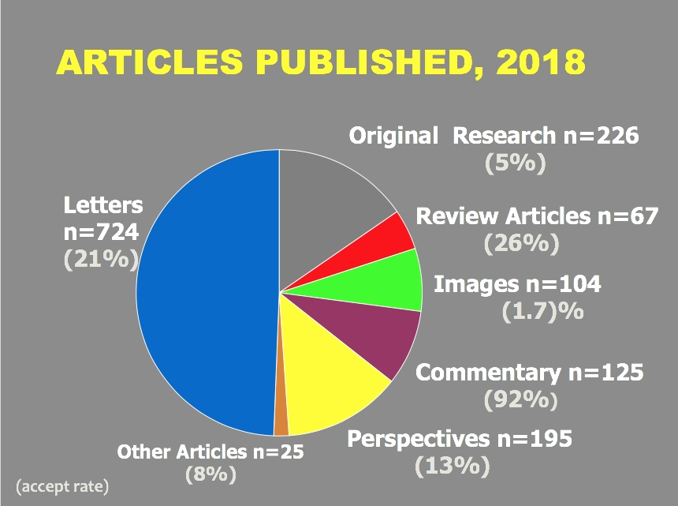
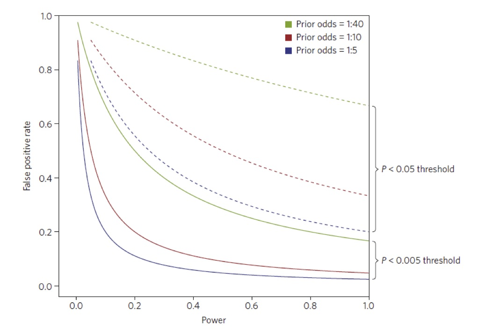

## My coordinates

- Department of Biostatistics, Harvard T.H. Chan School of Public Health

- Department of Data Sciences, Dana-Farber Cancer Institute

- Statistical Consultant, New England Journal of Medicine

- Member, MSKCC Phase 3 DSMB

- davidharrington@g.harvard.edu

## Background

Revised author guidelines on statistical reporting posted on NEJM website 1 July 2019

https://www.nejm.org/author-center/new-manuscripts

Goal: More consistency in both statistical reviews and articles

Editorial describing the guidelines published 18 July 2019

- N Engl J Med 2019; 381:285-286

Guidelines cover many aspects of statistical reporting

Editorial emphasized section on p-values

## Navigating NEJM

\centering

{width=100%}


## Statistical Review at NEJM

Six paid statistical consultants (reviewers)

We meet weekly with the editors

Review all research articles that editors decide to move through the system

- We see approximately 5% of the 5,000 - 6000 submitted articles

Statistical reviewers 

- Help set statistical 'policy'

- Work toward consistency in reviews


## Why did we fuss with $p$-values?

Many submitted manuscripts side-stepped the issue of multiplicity

- Possibly inflated type 1 error rates when comparing many endpoints to assess an intervention or an exposure

- True in both randomized trials and observational studies

- Becoming more prevalent in complex studies with many measurements

Particularly important in trials with negative primary outcomes

VITAL trial is a useful example


## VITAL: \underline{Vit}amin D and Omega-3 Tri\underline{al}

Manson JE, et al. NEJM 2019; 380:23-32 (3 Jan 2019)

Factorial design, (Vit D vs placebo) $\times$  (Omega-3 vs placebo)

25,871 participants randomized    

- 12,927 Vit D vs 12,944 placebo    
- 12,933 n-3 vs 12,938 placebo

Primary endpoints: invasive cancer, composite cardiovascular outcome

## Omega-3 vs placebo comparison 

2 co-primary endpoints: invasive cancer, composite CV outcome

- Both negative

22 secondary/exploratory outcomes

2 traditionally significant

- Total MI, total coronary heart disease (composite)

13 subgroups analyzed for possible treatment interactions

- No `significant' ($p < 0.05$) interactions


## `Black Box' warning in the protocol


\begin{quote}

There was no control for multiple hypothesis testing, and no formal adjustment was made to the P values or confidence intervals. Thus, the results regarding exploratory end points and subgroups should be interpreted with caution. 

\end{quote}

What is the potential harm?


- None, if the $p$-value is a simple descriptor of a calculation

- Considerably more, if a few significant comparisons are viewed as evidence for a treatment effect  

    - Especially when the primary outcome is negative


## P-values in medical literature

$p < 0.05$ proposed by Fisher (1926) for single comparisons in randomized experiments:

\begin{quote}

The value for which $P = 0.05$, or 1 in 20, is 1.96 or nearly 2; it is convenient to take this point as a limit in judging whether a deviation ought to be considered significant or not. 

\end{quote}

A $p$-value measures how much the observed data disagree with a hypothesis of no treatment effect.

It is sometimes incorrectly interpreted as a measure of the reproducibility of a trial 

- or $p < 0.05$ implies that the chance that the intervention works is at least 95\%


## Analogy with diagnostic testing

In a hypothesis test

Power of the test is likelihood of detecting a true effect    

- \textcolor{darkblue}{Sensitivity}

Significance level of a test is the chance of test being positive when effect is null 

- It is the false positive rate, or \textcolor{darkblue}{1 - Specificity}

The positive predictive value of a hypothesis test is the chance the intervention is effective when the test is statistically significant

## Prevalence affects false positive rate 

Next slide shows a graph of \textcolor{darkblue}{probability of a false positive} conclusion in favor after a \textcolor{darkblue}{statistically significant} result, based on 

- Power of the study

- Significance level threshold

- \textcolor{forest}{Prior odds of a treatment effect}


## False positive probability, p-value, power (Nat. Human Behavior, Jan 2018)


{width=100%}


## What if the actual threshold for a 'significant' result is larger than 0.05?


```{r, echo= F, eval = T}
library(knitr)
power = 0.80

alpha = 0.10
num.regimes = 3
fpp = vector("numeric", num.regimes)
prior.odds = c(1/5, 1/10, 1/40)
prior.odds.string = c("1:5", "1:10", "1:40")

prob.null.true = 1 - (prior.odds /(1 + prior.odds))

for(k in 1:num.regimes){
  fpp[k] = (alpha * prob.null.true[k]) /(alpha * prob.null.true[k] + 
                                           power * (1 - prob.null.true[k]))
}

fpp.table.10 = cbind(signif(alpha,2), prior.odds.string, round(prob.null.true,2), round(fpp,2))


alpha = 0.25
num.regimes = 3
fpp = vector("numeric", num.regimes)
prior.odds = c(1/5, 1/10, 1/40)

prob.null.true = 1 - (prior.odds /(1 + prior.odds))

power = 0.80

for(k in 1:num.regimes){
  fpp[k] = (alpha * prob.null.true[k]) /(alpha * prob.null.true[k] + 
                                           power * (1 - prob.null.true[k]))
}

fpp.table.25 = cbind(signif(alpha,2), prior.odds.string, round(prob.null.true, 2), round(fpp, 2))

fpp.table = data.frame(rbind(fpp.table.10, fpp.table.25))


colnames(fpp.table) <- c("Alpha", "Prior Odds", "Prob Null", "False Pos. Prob")


kable(fpp.table[1:6,1:4], digits = 2)
```

False Pos. Prob = probability of incorrectly claiming alternative is true, given data

Calculations assume power = 0.80


## The effect of multiplicity


The more tests in a set of comparisons, the more likely it is that at least one will be a false positive. \medskip

Suppose each test is done at level $\alpha = 0.05$, and the endpoints are independent.

-------------------------------------------------------
  Number of Comparisons        Overall Type I Error Prob.
------------------------- -----------------------------
    1                        0.05 

    2                        0.10 

    3                        0.14 

    5                        0.23 

    10                        0.40
    
     20                       0.64
   
--------------------------------------------------------

## Effect of increasing $\alpha$

Prior odds = 1:10, power = 0.80


```{r, echo = F, eval = T}
power = 0.80

alpha = c(0.10, 0.15, 0.20, 0.25, 0.40, 0.60)
num.regimes = 6
fpp = vector("numeric", num.regimes)
#prior.odds = c(1/5, 1/10, 1/40)

prior.odds = 1/10

prob.null.true = 1 - (prior.odds /(1 + prior.odds))

power = 0.80
for(k in 1:num.regimes){
  fpp[k] = (alpha[k] * prob.null.true) /(alpha[k] * prob.null.true + 
                                           power * (1 - prob.null.true))
}

fpp.table = cbind(alpha, fpp)

colnames(fpp.table) <- c("Alpha", "False Pos. Prob.")

kable(fpp.table[1:num.regimes, ], digits = 2)

```


False Pos. Prob. = probability of incorrectly claiming alternative is true, given data


## Not just a theoretical issue

Between 2000 and 2010:

- 1425 RCTs published in NEJM

- Among these trials, 222/1425 negative primary outcomes

- Among trials with negative primary outcomes, 121/222 "positive" secondary outcomes or subgroup by treatment interactions    

    - 73 with a positive subgroup     
    - 36 positive secondary outcome    
    - 12 with 'nearly positive' outcome
    
- Of 121 with a presumed signal

    - 21 were replicated and showed positive primary outcome
      

## Recommendations in the current guidelines

If a statistically sound method for multiple tests was specified in the protocol or SAP, please follow it explicitly.

If there was no such plan

  - Acknowledge the lack of a plan.
    
  - Report secondary outcomes using only point estimates of treatment effect and 95\% confidence intervals.
    
  - Specifically state that the confidence intervals have not been adjusted for multiplicity and cannot be used to support claims about treatment effects.
    

## Implications of the recommendations

Makes available all data on primary and secondary outcomes

- Without conclusions not likely to be reproducible

- What did you see vs. what did you learn?

Confidence intervals are more informative than $p$-values

Makes demands of our readers

Requires careful editing of manuscripts

Policy applies to observational studies as well as RCTs

A purely statistical perspective oversimplifies the treatment of negative trials.

- See Pocock and Stone, NEJM 2016: "The primary outcome fails \ldots"


## Shanafelt, et al. NEJM 2019

\begin{quote}

Patients 70 years of age or younger with previously untreated CLL were randomly assigned to receive ibrutinib plus rituximab or chemoimmunotherapy with fludarabine, cyclophosphamide, and rituximab.

The ibrutinib-based regimen led to prolonged progression-free and overall survival.

\end{quote}

Figure 2 from article on next slide

----

\centering

{width=60%}

## The PFS curves

\centering


## Subgroups

\centering


## The wider debate about $p$-values

$p$-values 

- do not indicate the size of an effect

- nor do they indicate the likelihood of an effect

Fisher never intended 'significant' to mean 'statistically significant'

- Is 'statistically significant' a meaningless term?

A true $p < 0.05$ may not reduce the false positive rate enough


## False positive probability, p-value, power (Nat. Human Behavior, Jan 2018)


{width=100%}

## The wider debate...

From our editorial

\begin{quote}
The notion that a treatment is effective for a particular outcome if P<0.05 and ineffective if that threshold is not reached is a reductionist view of medicine that does not always reflect reality.
\end{quote}

But we need clearly articulated decision rules in evidence-based medicine

- Reproducibility and Replicability in Science (2019)  http://nap.edu/25303

## Also in the guidelines

Principled analyses of studies with missing data

Acceptable to use unadjusted p-values for safety outcomes

Protocol and Statistical Analysis Plan (SAP) required for clinical trials

Submit SAP for observational studies if it exists

Require model diagnostics for observational studies

Accompanying editorial gives references to methods for controlling error rates with multiple tests

---- 

Talk is available under mskcc_2019-nejm at

https://github.com/dave-harrington/talks

## Some references

\small

Wasserstein RL, Schirm AL, Lazar NA. Moving to a world beyond p<0.05. Am Stat. 2019;73:1-19. doi:10.1080/00031305.2019.1583913

National Academies of Sciences, Engineering, and Medicine. Reproducibility and replicability in science. Washington, DC: National Academies Press, 2019. http://nap.edu/25303

Dmitrienko A, D’Agostino RB Sr. Multiplicity considerations in clinical trials. N Engl J Med 2018;378:2115-22.

Benjamin DJ, et al. Redefine statistical significance. Nat Hum Behavior 2018;2:6-10. doi: 10.1038/s41562-017-0189-z

Ioannidis JPA. Retiring statistical significance would give bias a free pass. Nature. 2019;567 (7749):461. doi:10.1038/d41586-019-00969-2


