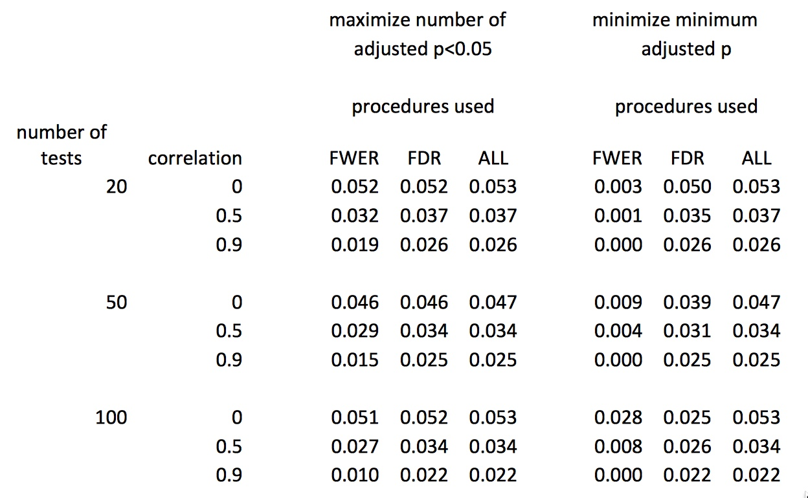
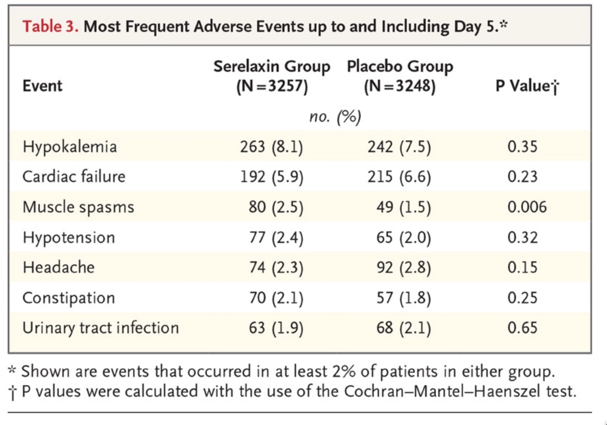
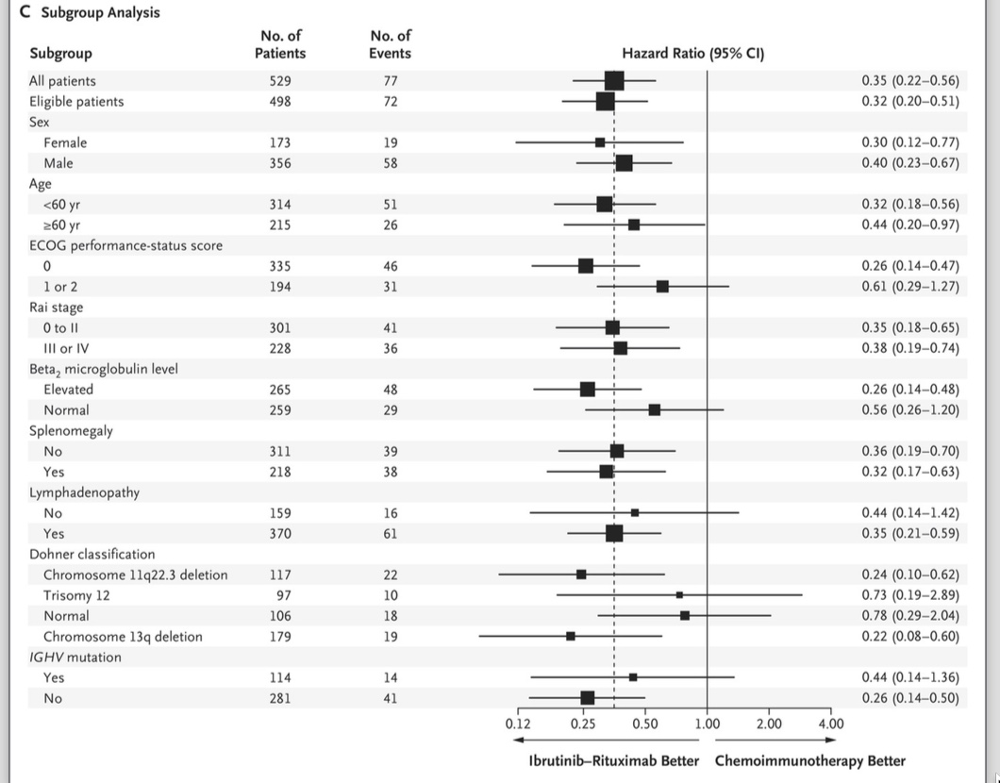
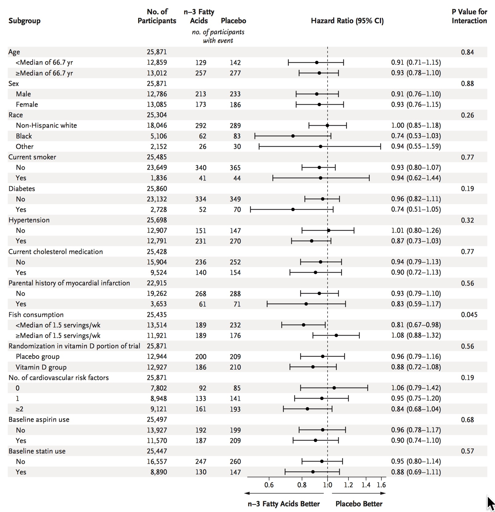
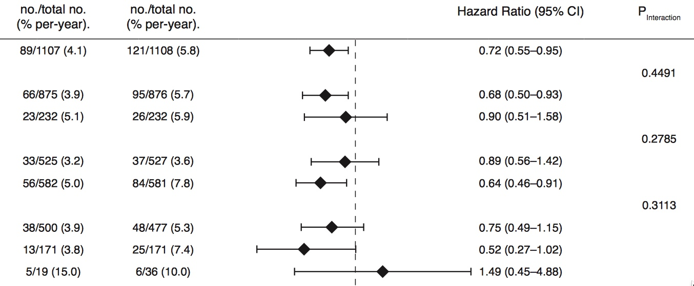

## My coordinates

- Department of Biostatistics, Harvard T.H. Chan School of Public Health

- Department of Data Sciences, Dana-Farber Cancer Institute

- Statistical Consultant, New England Journal of Medicine

- davidharrington@g.harvard.edu

## Guidelines were joint effort

Statistical Consultants in addition to myself

- Ralph D'Agostino, BU    
- Constantine Gatsonis, Brown    
- Joe Hogan, Brown
- David Hunter, Oxford    
- Sharon-Lise Normand, HMS

Jeff Drazen, former Editor-in-Chief

Mary Beth Hamel, Executive Deputy Editor

All Deputy Editors read and approved guidelines


## Statistical Review at NEJM

Six paid statistical consultants (reviewers)

We meet weekly with the editors

Review all research articles that editors decide to move through the system

- We see approximately 5% of the 5,000 - 6000 submitted articles each year

Statistical reviewers 

- Help set statistical 'policy'

- Work toward consistency in reviews


## Background

Revised author guidelines on statistical reporting posted on NEJM website July 1, 2019

https://www.nejm.org/author-center/new-manuscripts

Editorial describing the guidelines published July 18, 2019

- N Engl J Med 2019; 381:285-286

Guidelines cover many aspects of statistical reporting

Editorial emphasized section on $p$-values

## Our goals

Emphasize aspects of good practice in analysis and reporting

- All points discussed have been in the statistical literature for decades

Add consistency to

- Statistical reviewing at NEJM

- Standards of analysis in reporting of results

Move toward standards of reporting in observational studies

- Elements of STROBE (Strengthening of Reporting of Observational Studies in Epidemiology)

- https://strobe-statement.org/

## Goals \ldots

Show the data

- Point estimates and confidence intervals

- Reduce irrelevant $p$-values

Acknowledge that we cannot influence design

Every good paper should have a path to publication, even with

- No planned adjustment for multiplicity

- No specified method for missing data

## Goals \ldots

Minimize misleading or misunderstood statistical jargon

- Nominal p-value

- Nominally significant

- 'Controlling' for confounders in regression models


## Our constraints

For busy clinicians, conclusions in a paper should be clear, direct, and supportable.

Statistical background of NEJM readers

Word limits in NEJM make it difficult to discuss nuance.   

- 250 words for abstracts 

- 2700 words for article

Normal review time and weekly publication schedule make transition to major changes difficult.

## Content of the guidelines

For all studies

- Describe sample size and power calculations

- $p$-values should be two-sided.

For RCTs:

- Provide protocol and statistical analysis plan (SAP).    

- Analysis should match design

- Specify and follow multiplicity adjustments in SAP    

    - \textcolor{darkblue}{No plan for multiplicity adjustment: report point estimates with confidence intervals, no $p$-values}

## The guidelines \ldots

RCTs:

- Forest plots for subgroups, \textcolor{darkblue}{but no $p$-values}

- \textcolor{darkblue}{OK to use unadjusted $p$-values for safety comparisons}

- Report event rates as well as hazard ratios

- Provide CONSORT diagram

## The guidelines

Observational studies:

- Provide a SAP if you have one

    - No SAP - provide a clear analysis plan in methods section or supplement   

- \textcolor{darkblue}{No plan for multiplicity adjustment: report point estimates with confidence intervals, no $p$-values}

- Show distributions of the measured confounders

- Model diagnostics and sensitivity analyses in the supplement

- If possible, retest findings in a validation dataset

## What about those unadjusted confidence intervals?

Is a confidence interval always a test in disguise?

Interpretation of confidence intervals by readers

Typical insert I recommend to authors for methods:

\begin{quote}
Because the statistical analysis plan did not include a provision for correcting for multiplicity, secondary and other outcomes are reported as point estimates and 95\% confidence intervals. The widths of the confidence intervals have not been adjusted for multiplicity, so the intervals should not be used to infer definitive treatment effects for secondary outcomes.

\end{quote}


## Post hoc adjustments for multiplicity

\small

Personal communication from Rebecca Betensky

For each of 10,000 replicates in a simulation   

- Simulate collection of correlated p-values    
- Choose a method of FWER or FDR control that is most favorable to the analyst    

    - Minimize the minimum $p$-value or     
    - Maximize the number of adjusted $p$-values < 0.05
    
- Average FWER or FDR across replicates

Choice of methods from

- FWER: Bonferroni, Holm, Hochberg, Hommel, \v{S}id$\acute{\textrm a}$k single step, \v{S}id$\acute{\textrm a}$k step down.

- FDR: Benjamini-Hochberg, Benjamini-Yekutieli, two-stage Benjamini-Hochberg.
    
## Results

\centering


    
## Perils of post hoc adjustment

Does not distinguish between confirmation and discovery

Are all the primary secondary and subgroup analyses part of the family of tests examining a treatment effect?

- If so, reduces power for primary outcome

## Unadjusted $p$-values in safety outcomes

From Metra, et al. N Engl J Med 2019; 381:716-726
DOI: 10.1056/NEJMoa1801291

\centering

{width=70%}


## $p$-values for interactions

Did we do more harm than good in eliminating $p$-values in forest  plots of subgroups?

Deputy editors, authors and some statisticians reluctant to eliminate these

- Authors and editors found lists of non-significant p-values reassuring.

- Easy to recommend that significant $p$-values be ignored.

- No easy general recommendation for point estimates and confidence intervals for interaction effects.

## New form of forest plots

\centering



## Before change

\centering



## Perhaps p-values are helpful

\centering




## Calculating posterior odds (Nat. Human Behavior, Jan 2018)

{width=100%}

## Effect of increasing $\alpha$

Prior odds = 1:10, power = 0.80


```{r, echo = F, eval = T}
library(knitr)

power = 0.80

alpha = c(0.10, 0.15, 0.20, 0.25, 0.40, 0.60)
num.regimes = 6
fpp = vector("numeric", num.regimes)
#prior.odds = c(1/5, 1/10, 1/40)

prior.odds = 1/10

prob.null.true = 1 - (prior.odds /(1 + prior.odds))

power = 0.80
for(k in 1:num.regimes){
  fpp[k] = (alpha[k] * prob.null.true) /(alpha[k] * prob.null.true + 
                                           power * (1 - prob.null.true))
}

fpp.table = cbind(alpha, fpp)

colnames(fpp.table) <- c("Alpha", "False Pos. Prob")

kable(fpp.table[1:num.regimes, ], digits = 2)

```

False Pos. Prob = probability of incorrectly claiming alternative is true, given data

## Assumptions behind the calculations

Decision to use an intervention based on single trial, single $p$-value

Prior odds is knowable, at least approximately

There is a simple alternative for which power is relevant

Assumes reproducibility the right metric

## Have we enabled unsupported claims?

Common to encounter phrases in drafts such as 

\begin{quote} A consistent pattern for improved survival \ldots was noted across multiple subgroups
\end{quote}

or

\begin{quote}

In exploratory \ldots analysis \ldots of patients who resumed [the intervention], it  was superior to that of patients who did not

\end{quote}

----

PDF of slides available at under mskcc_2019 at

https://github.com/dave-harrington/talks


## Reading

\small


Benjamin DJ, et al. Redefine statistical significance. Nat Hum Behavior 2018;2:6-10. doi: 10.1038/s41562-017-0189-z

Ioannidis JPA. Retiring statistical significance would give bias a free pass. Nature. 2019;567 (7749):461. doi:10.1038/d41586-019-00969-2

National Academies of Sciences, Engineering, and Medicine. Reproducibility and replicability in science. Washington, DC: National Academies Press, 2019. http://nap.edu/25303

Wasserstein RL, Schirm AL, Lazar NA. Moving to a world beyond p<0.05. Am Stat. 2019;73:1-19. doi:10.1080/00031305.2019.1583913

Dmitrienko A, Bretz F, Westfall PH, et al. Multiple testing methodology. In: Dmitrienko A, Tamhane AC, Bretz F, eds. Multiple testing problems in pharmaceutical statistics. New York: Chapman and Hall/CRC Press, 2009:35-98.


